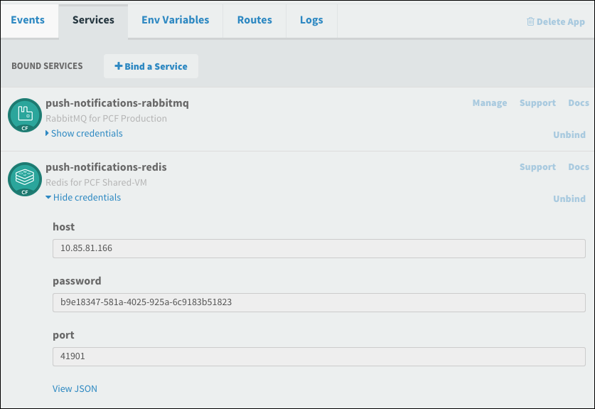
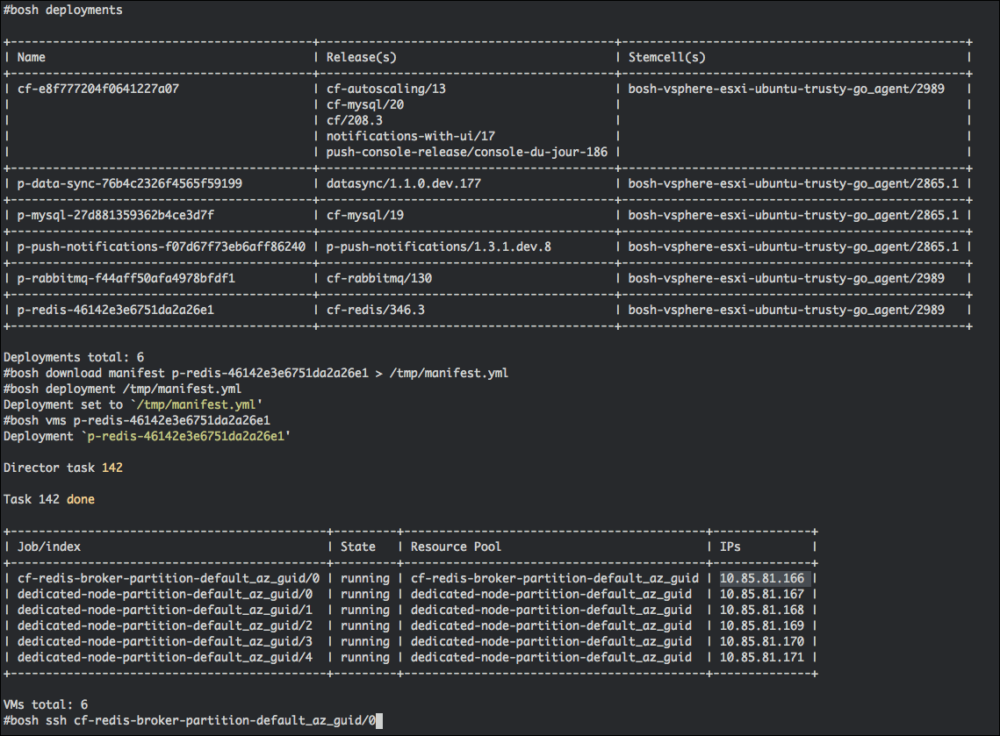

It is possible to create a backup of a redis instance manually by following these steps:

###Get Redis Instance Credentials

  1. In the developer console in the "system" org go to the "push-notifications" space and the "push-api" app
  1. Go to services
  1. click show credentials for push-notifications-redis; note the host, password, and port
  

### Backup Data

  1. Use `bosh deployments` to find the redis deployment
  1. Acquire the manifest for the redis deployment using `bosh download manifest %redis-deployment-name% > /tmp/manifest.yml`.
  1. Target your redis deployment with `bosh deployment /tmp/manifest.yml`.
  1. From the command, identify the VM which holds your instance by running `bosh vms`.
  1. You can identify the exact node for your service instance by comparing the IP Address from above.
  1. `bosh ssh` into your desired node.

  

  1. The `redis-cli` is located in `/var/vcap/packages/redis/bin/redis-cli`.
  1. Use the credentials from above to log into the `redis-cli`. Eg `/var/vcap/packages/redis/bin/redis-cli -p %port% -a %password%`
  1. You can trigger an update by using the `BGSAVE` command. This will create a `dump.rdb` file in the redis data directory.
    1. The `BGSAVE` command is aliased to a random string. This can be obtained from Ops Manager, in the Redis tile, under the credentials tab.
  1. Now use the `info server` command and look for the `config_file:` key to discover the location of the redis data directory.
  1. Exit the redis-cli, find and retrieve the dump file with `bosh scp`.

## Restore from backup

####Before restoring your RDB file you must have these pre-requisites:

  - Same resource configuration as the instance from which you backed up.
    - The persistent disk should be increased to be `3.5 x size of the RDB file` if it is not already so. This allows space for the temporary files used during the restore process

####Steps to Restore Data

1. Identify the VM on which the instance of your plan is located on by following the first 6 steps of the `Backup Data` section above.
1. `bosh ssh` into the identified VM.
1. Copy the RDB file you wish to restore to `/var/vcap/store/` as root or using `sudo`.
1. Identify the location of the `redis.conf` by using the redis-cli.
  1. See above for instructions on how to find the credentials
  1. Use the `info server` command and look for `config_file`.
  1. For example: `config_file:/var/vcap/store/cf-redis-broker/redis-data/91cb6551-e5b4-44d7-9a3a-8161a83a2783/redis.conf`
1. Stop all running `Redis` processed by running `sudo monit stop all`.
1. Open the file identified in an editor such as `vim`
  1. Modify the following value:
    1. From: `appendonly yes`
    1. To: `appendonly no`
  1. Save the file and exit.
1. Replace the `dump.rdb` file, in the same location as the config file from the previous step, with the file you copied over in step 3.
1. Confirm the file size of `dump.rdb` is as you expect by running `ls -alh`.
1. Restart the processes by running `sudo monit start all`.
1. Redis will now load the restored `dump.rdb` file into memory and write it back out to the AOF file.
  1. The amount of time this takes will depend upon your dataset size and other factors.
  1. To view progress, use the `redis-cli` and run the `info` command.
  1. Wait until you see `aof_rewrite_in_progress:0`.
1. Stop the running Redis process with `sudo monit stop all`.
1. Reverse the configuration changes in step 6 so you have `appendonly yes`.
1. Start the processes again with `sudo monit start all`.
1. You have now restored your Redis data.
