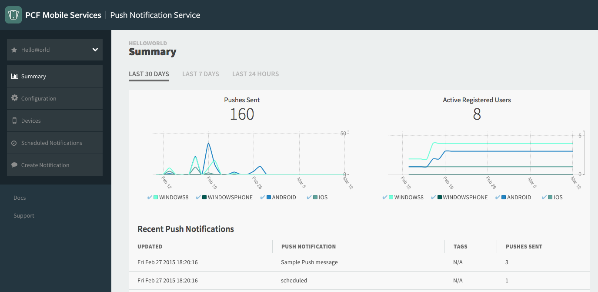
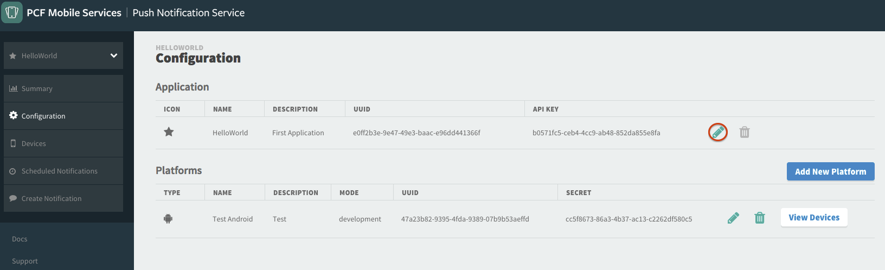
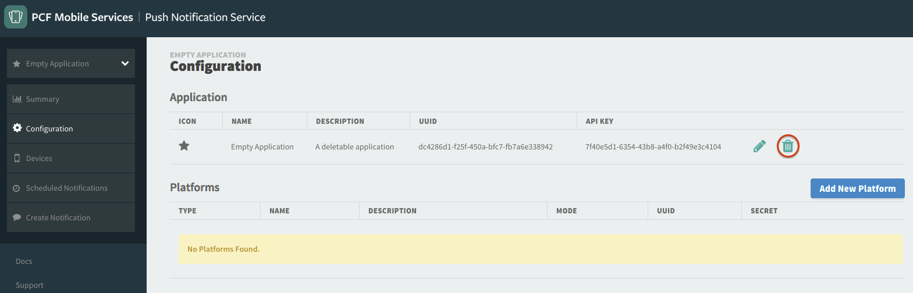
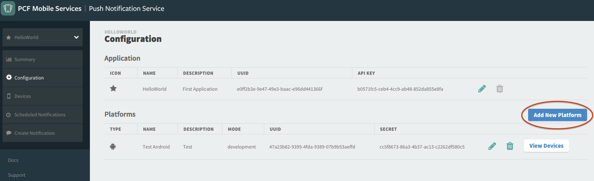
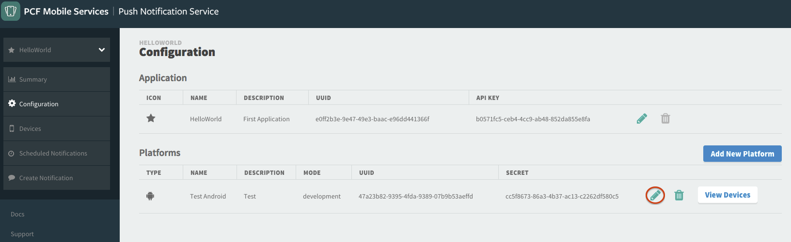
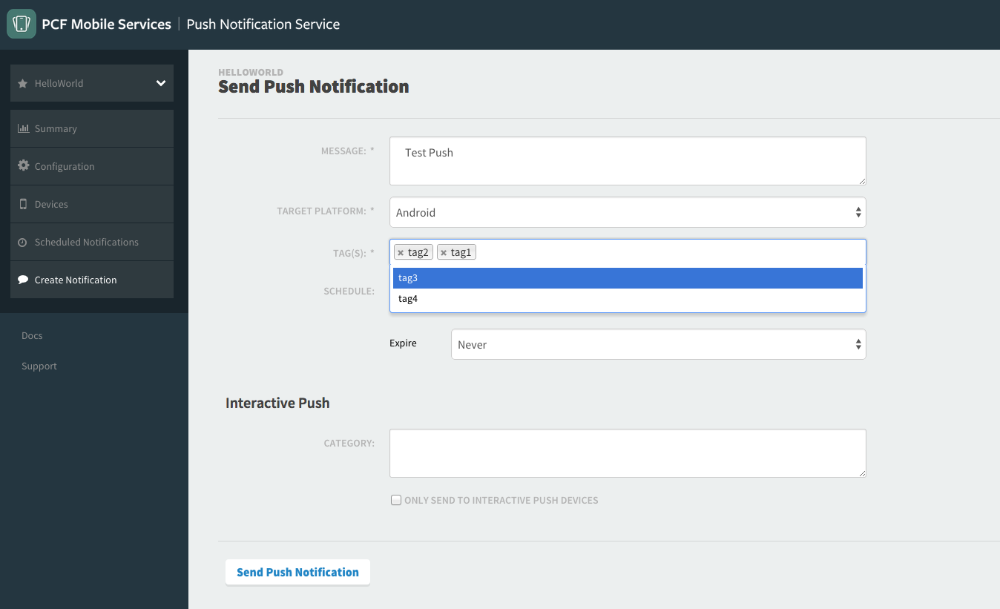

##Application
An application in the Push Dashboard represents a mobile application from the perspective of the application author, including all supported platforms. Applications are listed in the dropdown at the top of the sidebar.

###Adding an application
Click on `Create New Application` in left sidebar. Fill in the form and click `Save` to create the application or optionally click 'Add Platform' to add a platform for the application.

###Editing an application
Click on the `Configuration` link in the sidebar menu to bring up the information about the application. Click on the pencil icon under the `Actions` column to edit the application. Edit the fields and click `Save` to update the application. The **UUID** is immutable.

###Deleting an application
To delete an application, click on the `Configuration` link in the sidebar menu to bring up information about the application. Click on the delete icon under the `Actions` column to delete the application. Note that this icon will be disabled if the application has one or more platforms. 

##Platform
A platform configures platform specific attributes to send push messages. For example, this would include a certificate necessary to send messages to Apple's APNS, or a token necessary to send messages to Google's GCN. A platform has many devices.

###Adding a platform
On the Configuration page, click on the `Add New Platform` button . Fill in the form and click `Save` to create the platform.

###Editing a platform
On the Configuration page, click on the pencil icon link next to the platform you want to edit. Edit the fields and click `Save` to update the platform. The  **Type** field cannot be changed once set.

###Deleting a platform
On the Configuration page, click on the trash icon link next to the platform you want to delete. NOTE: You cannot delete a platform that has devices.

##Devices
A device is given a unique identifier which represents a user opting in to receive push notifications. This identifier is not necessarily unique to a device since it might change if the user reinstalls the mobile application, or unsubscribes and resubscribes.

###Send a test push notification to a device
Click on 'Devices' in the sidebar menu. Click on the `Test Push` button next to the device. Fill out the push form. See "Sending a push message" for details on the form fields.

##Sending a push message
Click on `Create Push Message` in the sidebar menu.

On the Create Push Message page, fill in the form and click `Send Push Message`. 

* Push Message: The alert body for the message
* Target Platform: Send the push to all devices belonging to a specific platform (eg. iOS, Android, etc)
* Tag(s): Send the push to all devices subscribed to one or more tags
* Schedule
	* Send: Schedule the push to be sent immediately or at a later time. Defaults to "Immediately".
	* Expire: Prevent delivery of the message after a specified time, if delivery is delayed for some reason (eg. no connectivity on user device). Default 	  is "Never".
* Category
	* __iOS Only__ - Set the category for a push (required for interactive pushes)
* ONLY SEND TO INTERACTIVE PUSH DEVICES: Filter targetted devices for __only__ devices that support interactive push
	
**A Note About Targetting**

`Target Platform` will target all devices of the selected platform. Adding tags to the `Tag(s)` field will refine the target list down, adding only those devices subscribed to one of the listed tags. 

##Tags
A tag allows push notifications to be sent to all devices that have explicitly subscribed to it as opposed to all users that have the application installed. This allows an application to send targeted push notifications to a subset of devices. Devices can subscribe to tags via the <a href="api/registration/">registrations api</a>. Available tags are listed in the targetting section of the Create Notification form.

